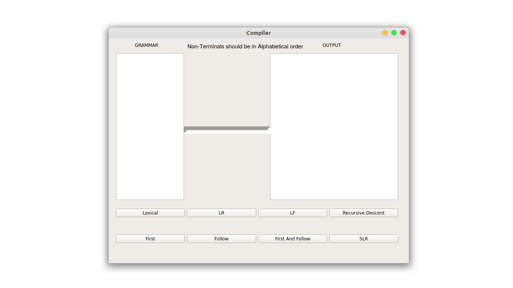
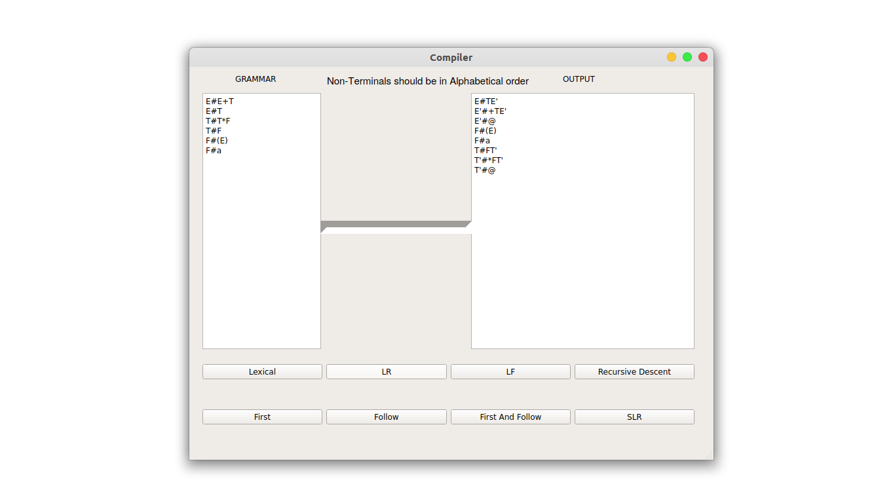
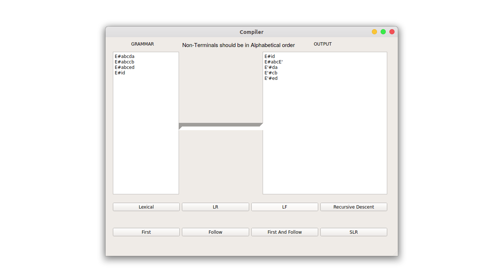
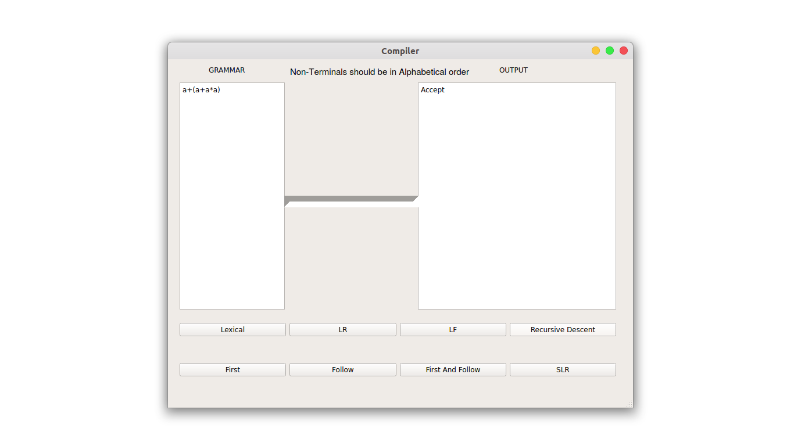
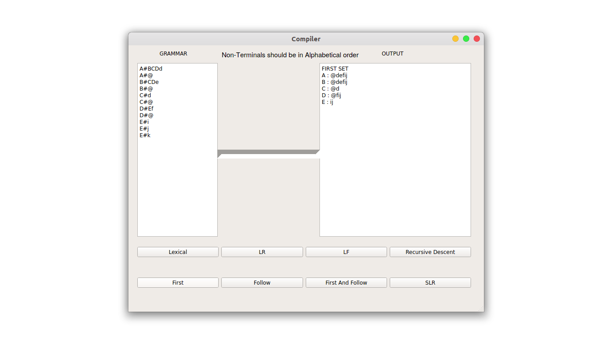
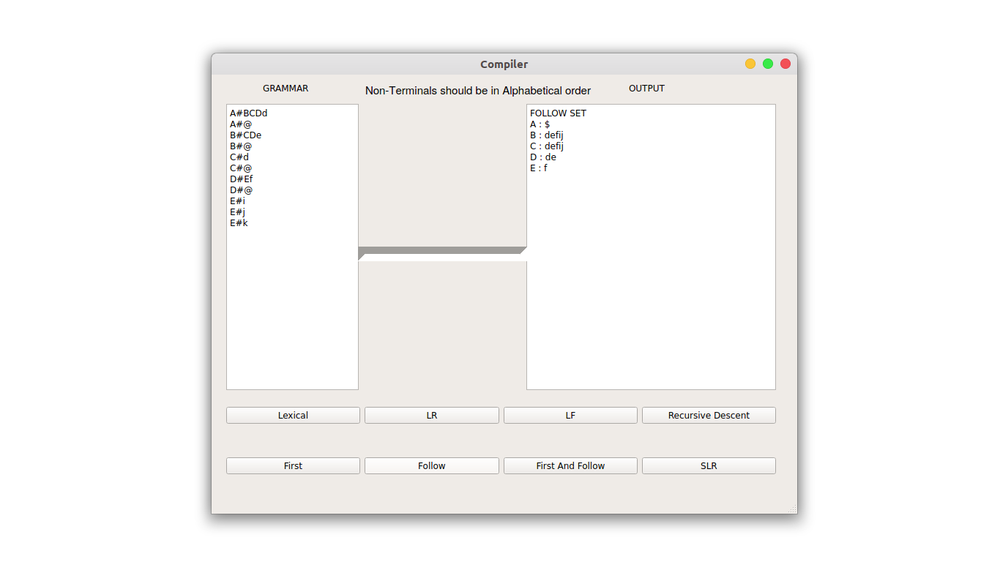
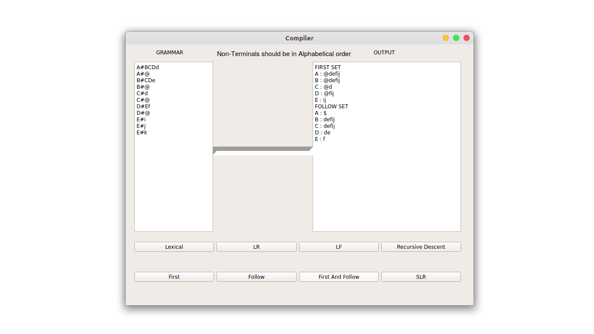

# Compiler Design Tool In C++
		
This is the Tool which can implement the phages of Compiler-Design which has been developed in Java programming lanuage.

# About

This is the tool which can calculate First, Follow and FirstAndFollow of given grammar, perform string validation of Recursive Descent parser, remove left recursion & left factoring from grammar, SLR string validation for fixed grammar, tokenized the given input file which can be in C/C++, JAVA, PYTHON and so on... 

  

  

# Add Features

The implemented tool has following features...

1. Added the feature that lexical analysis phage of compiler in which just need to provide the path of input file(file can be C/C++, JAVA, PYTHON, etc...) and this tool will be tokenized each in line of given input file.

2. Added the feature of removable of left recursion for the given input grammar.
 
3. Added the feature of removable of left factoring for the given input grammar.

4. Added the feature of string validation of Recursive Descent parser for the following fixed grammar...
		
		1.) E--> E + T
		2.) E--> T
		3.) T--> T * F
		4.) T--> F
		5.) F--> (E)
		6.) F--> a

		The string will be something like a+a$, a+a*a$, a+(a+a*a) and so on...	
		

5. Added the feature of calculation of first for the given input grammar.

6. Added the feature of calculation of follow for the given input grammar.

7. Added the feature of calculation of firstAndFollow simultaneously for the given input grammar.

8. Added the feature of string validation of SLR parser for the following fixed grammar...

		1.) E--> a E a
		2.) E--> b E b
		3.) E--> c
		
		The string wiil be something like c, aca,aabbcbbaa, bacab and so on...

## USAGE
   
   C++, Qt Creater, PyQt5.
   
## REQUIREMENT
 
### Environment:
  
   Source code to this project is coded in C++, with its GUI running in PyQt5.
 
 
### Packages:

   C++, Qt Creater, PyQt5.

 
# INSTALLATION 

	$ sudo apt-get install libglu1-mesa-dev

## Qt Creater IDE
 
   Download [Qt Creater](https://www.qt.io/download) IDE .exe file for Window or qt-unified-linux-x64-3.1.1-online.run file for Ubuntu
   
### For Window

   Just double click on the .exe file and follow the instruction.

### For Ununtu

	$ cd downloads/
	$ chmod 777 qt-unified-linux-x64-3.1.1-online.run
	$ ./qt-unified-linux-x64-3.1.1-online.run
 		

# Clone repository :

	$ git clone https://github.com/RadheTians/Compiler-Design-Tool-In-CPP.git
	$ cd Compiler-Design-Tool-In-CPP

# Running locally :
 
1. Open the Qt Creater IDE.

2. Import the project directory on Qt Creater IDE

3. And run compiler.cpp file.

# How to Use

This tool has nine buttons, one input field and one output field and their working precedure is following...

1. Provide the path of input file(File can be C/C++, Python, Java, etc...) in input text field which is at the left and press Lexical button after doing this, tool will be tokenized the given input file.

2. Provide the grammar in input text field which has left recursion and press LR button after doing this, tool will be removed left recursion from given grammar.

3. Provide the string for fixed grammar and press Recursive Descent button after doing this, recursive descent parser will be parsed the string and tell the status of given string(i.e Accept or Reject) and the grammar is following...

		1.) E--> E + T
		2.) E--> T
		3.) T--> T * F
		4.) T--> F
		5.) F--> (E)
		6.) F--> a

		The string will be something like a+a$, a+a*a$, a+(a+a*a) and so on...	

4. Provide the grammar in input text field which has left factoring and press LR button after doing this tool will be removed left factoring from given grammar.

5. Provide the grammar in input text field and press First button after doing this, tool will be calculated first of the given grammar.

6. Provide the grammar in input text field and press Follow button after doing this, tool will be calculated follow of the given grammar.

7. Provide the grammar in input text field and press FirstAndFollow button after doing this, tool will be calculated first and follow of the given grammar.

8. Provide the string for fixed grammar and press SLR button after doing this, SLR parser will be parsed the string and tell the status of given string(i.e Accept or Reject) and the grammar is following...

		1.) E--> a E a
		2.) E--> b E b
		3.) E--> c
		
		The string wiil be something like c, aca,aabbcbbaa, bacab and so on...

<b>Attention:-</b> 

  

  

  

  

  

  

